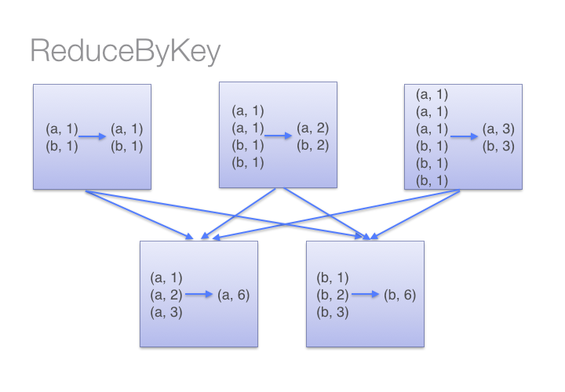
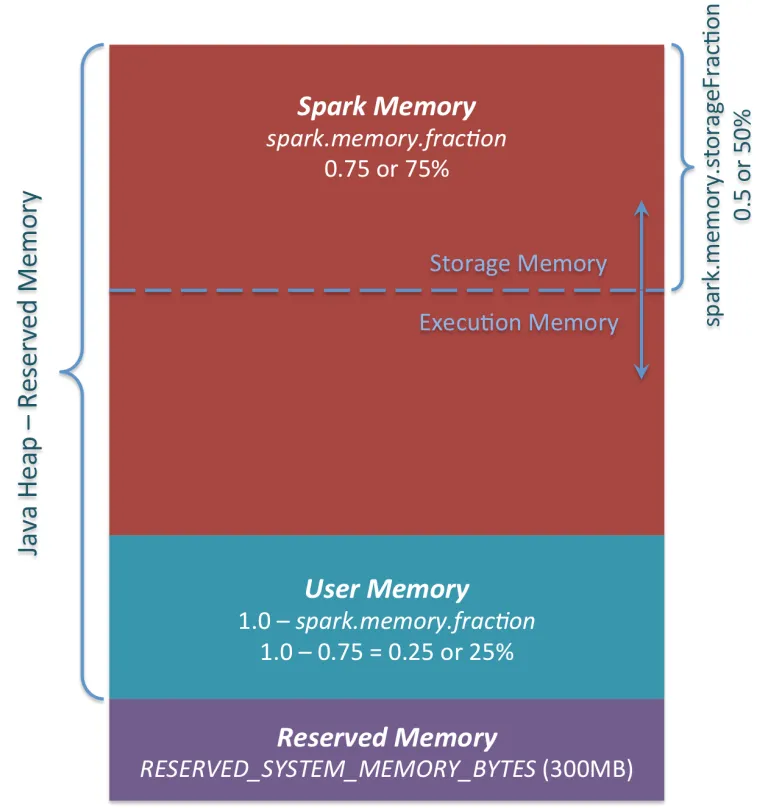
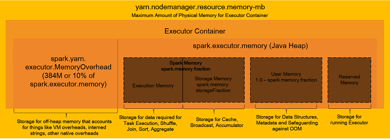
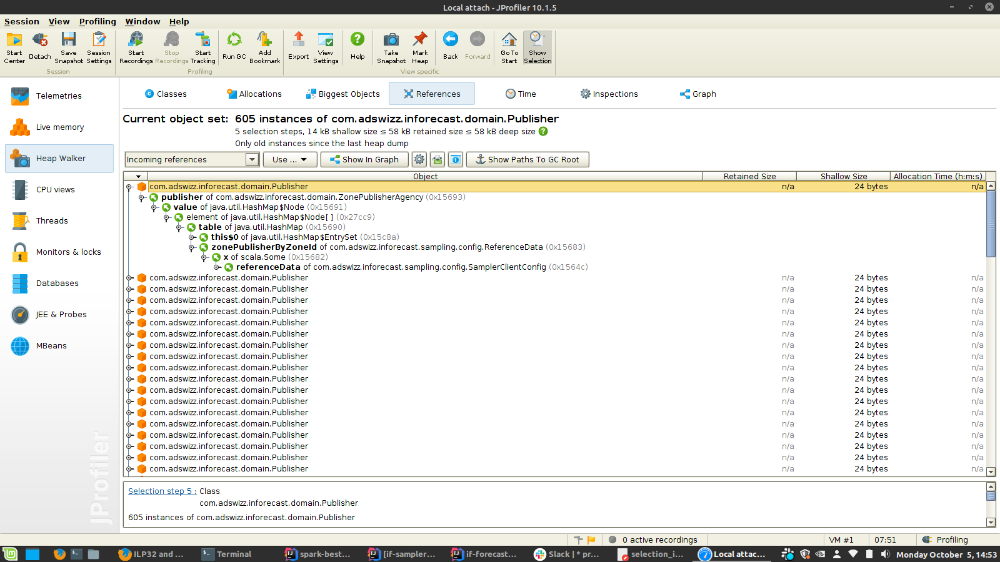

= Troubleshooting spark issues

== CPU / runtime performance issues

== Symptoms
* slow processing time, obviously
* just a fraction of your processing power is used

image::images/cluster_cpu_wrong_distribution_of_tasks.png[]

== Solutions

* human error (unneeded processing)

[source,scala]
----
case class OpportunityRequestData(oppo : ForecastedOppoWithPoi, log: Logger) extends RequestData {

  val queryParamMapFromString = QueryParamMapBuilder.buildQueryParamMap(
    oppo.forecastedOppo.getUrlQuery,
    oppo.commaSeparatedPois
  )

  override def getOperatingSystem: String = oppo.forecastedOppo.getOs

  override def getPlayerDeviceName: String = oppo.forecastedOppo.getDeviceType
  //other getters here ...
}

def matchOpportunityWithCampaign(limitationMatcher: BannerLimitationMatcher,
                                  oppoWithPoi: ForecastedOppoWithPoi,
								  campaign: Campaign): Iterable[(Zone, Banner)] =
    for {
        banner <- campaign.getBanners.asScala
        zone <- matchZones(oppoWithPoi.forecastedOppo, banner)
        if limitationMatcher.matchesLimitations(oppoWithPoi, banner)
    } yield zone -> banner
}

def matchesLimitations(opportunity: ForecastedOppoWithPoi, banner: Banner) : Boolean = {
    limitationEvaluator.evaluate(banner.getLimitation, OpportunityRequestData(opportunity, log))
}
----

* persist when re-using RDDs

[source,scala]
----
val rdd = dataComputation
val partitionedRdd = rdd.partitionBy(...)
partitionedRdd.persist(StorageLevel.MEMORY_AND_DISK_SER)
val result1 = partitionedRdd.map(...).collect()
val result2 = partitionedRdd.flatMap(...).saveAsHadoop()
----

* Kryo serialization

.java serializers speed comparison

.java serializers memory consumption comparison
image::images/kryo-space.png[]

more details https://github.com/eishay/jvm-serializers/wiki[here]

.how to set up kryo in spark
[source, scala]
----
sparkConfig
  .set("spark.serializer", "org.apache.spark.serializer.KryoSerializer")
  .set("spark.kryo.registrationRequired", "true")
  .set("spark.kryo.registrator", classOf[ForecasterKryoRegistrator].getName)
----

Besides the https://github.com/EsotericSoftware/kryo/blob/master/src/com/esotericsoftware/kryo/Kryo.java#L179[default serializers] provided by Kryo, there are https://github.com/magro/kryo-serializers[other libraries] to help you with that

* avoid unnecessary partitioning (ex. groupByKey vs. reduceByKey)

image::images/groupByKey.png[]

https://databricks.gitbooks.io/databricks-spark-knowledge-base/content/best_practices/prefer_reducebykey_over_groupbykey.html[image source]

* check CPU hotspots with a profiler

* make sure your partitions are balanced (data is evenly distributed)

* prefer Async collection operation (i.e. collectAsync) for CPU related issues

* Combine multiple RDD.maps/flatMaps/filters into one single RDD.map operation if possible

== OutOfMemory issues

=== Symptoms 
* Explicit :
----
java.lang.OutOfMemoryError : GC overhead limit exceeded
----
or 
----
OpenJDK 64-Bit Server VM warning: INFO: os::commit_memory(0x0000000654a5e000, 837603328, 0) failed; error='Cannot allocate memory' (errno=12)
#
# There is insufficient memory for the Java Runtime Environment to continue.
# Native memory allocation (mmap) failed to map 837603328 bytes for committing reserved memory.
----
or 
----
Container killed by YARN for exceeding memory limits. 12.4 GB of 12 GB physical memory used. Consider boosting spark.yarn.executor.memoryOverhead.
----

* Hidden
----
  TimeoutException
----
or 
----
20/08/17 14:09:23 WARN DataStreamer: Exception for BP-2134224599-192.168.152.25-1597671528722:blk_1073741843_1019
java.io.EOFException: Unexpected EOF while trying to read response from server
    at org.apache.hadoop.hdfs.protocolPB.PBHelperClient.vintPrefixed(PBHelperClient.java:402)
    at org.apache.hadoop.hdfs.protocol.datatransfer.PipelineAck.readFields(PipelineAck.java:213)
    at org.apache.hadoop.hdfs.DataStreamer$ResponseProcessor.run(DataStreamer.java:1073)
----

=== Solutions
* check yout GC logs 
in EMR env they are in stdout. 
----
2020-09-29T07:16:17.239+0000: [GC (Allocation Failure) 2020-09-29T07:16:17.239+0000: [ParNew: 629120K->30791K(629120K), 0.2974821 secs] 633015K->98181K(2027264K), 0.2975878 secs] [Times: user=3.71 sys=0.06, real=0.30 secs] 
2020-09-29T07:16:20.218+0000: [GC (Allocation Failure) 2020-09-29T07:16:20.218+0000: [ParNew: 590023K->69888K(629120K), 0.2883358 secs] 657413K->195919K(2027264K), 0.2884263 secs] [Times: user=0.71 sys=0.04, real=0.29 secs] 
2020-09-29T07:16:21.062+0000: [GC (Allocation Failure) 2020-09-29T07:16:21.062+0000: [ParNew: 629120K->69888K(629120K), 1.2208962 secs] 755151K->592684K(2027264K), 1.2209997 secs] [Times: user=2.76 sys=0.39, real=1.22 secs] 
2020-09-29T07:16:22.283+0000: [GC (CMS Initial Mark) [1 CMS-initial-mark: 522796K(1398144K)] 601001K(2027264K), 0.0134823 secs] [Times: user=0.02 sys=0.00, real=0.01 secs]
----

If needed you can use https://gceasy.io/[GC Easy]

* avoid collecting too much data on driver (collect(), collectAsMap)

* unpersist broadcasted variables as soon as possible (sync if hot)

https://0x0fff.com/spark-memory-management/[image source]

* use mapPartitions with Iterators when possible

* avoid wrapper classes as much as possible

|===
| primitive/Wrapper | primitive size | wrapper size
| boolean |1 bit ?| 128 bits
| byte | 8 bits | 128 bits
| short, char | 16 bits | 128 bits
| int, float | 32 bits | 128 bits
| long, double | 64 bits | 192 bits
|===

.Example:
if-allocation :  30.0000 campaigns * 4000 hours (aprox) * 192 bits (Double) = 21GB

because https://stackoverflow.com/questions/258120/what-is-the-memory-consumption-of-an-object-in-java[java classes overhead]

* in hot areas : avoid Option if needed as it requires an extra wrapper class Ex. Option[Double]

* in hot areas : use primitive based collections instead of classic java collections and http://fastutil.di.unimi.it/[FastUtil] collections instead of Java/Scala collections

* nice to have in hot areas:
- prefer RDD.map / flatMap  over Iterator.map / flatMap
  - avoid transfers from java to scala and viceversa

* detect memory size of your structures
    - does not work for lazy structures ( RDD, Iterators)

> The best way to size the amount of memory consumption a dataset will require is to create an RDD, put it into cache,
> and look at the  “Storage” page in the web UI.

> To estimate the memory consumption of a particular object, use SizeEstimator’s estimate method.
    
* avoid as much as possible heavy-on-memory documented rdd operations ( groupBy, co-group , join ) footnote:[they provide an Iterable parameter] footnote:[they rely spark.CompactBuffer(s) which stores data in memory]

> Sometimes, you will get an OutOfMemoryError not because your RDDs don’t fit in memory, but because the working set of one of your tasks,
> such as one of the reduce tasks in groupByKey, was too large.
> Spark’s shuffle operations (sortByKey, groupByKey, reduceByKey, join, etc) build a hash table within each task to perform the grouping, which can often be large.
> The simplest fix here is to increase the level of parallelism, so that each task’s input set is smaller. Spark can efficiently support tasks as short as 200 ms, because it reuses one executor JVM across many tasks and it has a low task launching cost, so you can safely increase the level of parallelism to more than the number of cores in your clusters.

* executor.memory, spark.memory.fraction, spark.storage.fraction

* don't go over 32 GB / executor

> On an LP64 system, the heap used by a given program might have to be around 1.5 times larger than when it is run on an ILP32 system

> Compressed oops represent managed pointers (in many but not all places in the Java Virtual Machine (JVM) software) as 32-bit object offsets from the 64-bit Java heap base address.
> Because they're object offsets rather than byte offsets, oops can be used to address up to four billion objects (not bytes), or a heap size of up to about 32 gigabytes.

> compressed ordinary object pointers is supported and enabled by default in Java SE 6u23 and later.
> In Java SE 7, compressed oops is enabled by default for 64-bit JVM processes when -Xmx isn't specified and for values of -Xmx less than 32 gigabytes.

https://docs.oracle.com/en/java/javase/11/vm/java-hotspot-virtual-machine-performance-enhancements.html#GUID-932AD393-1C8C-4E50-8074-F81AD6FB2444[source]

* check which class/object is keeping your reference from being garbage collected :

* obvious steps:
    - consider increasing the driver / executor heap and their overhead
    - hardware configuration

== Disk / Networking issues
=== Symptoms
 * disk full errors

=== Solutions
* check the size of your persisted data ( spark ui )

* controll and gzip your shuffles if needed

[source,shell script]
----
 spark-submit App
  --conf spark.shuffle.compress=true \
  --conf spark.shuffle.spill.compress=true
----

* kryo

* control the size of hdfs blocks

* gzip spilled data to disk (see spark configuration for gzip )

* Obvious: make sure you don’t log too much (i.e opportunities)

